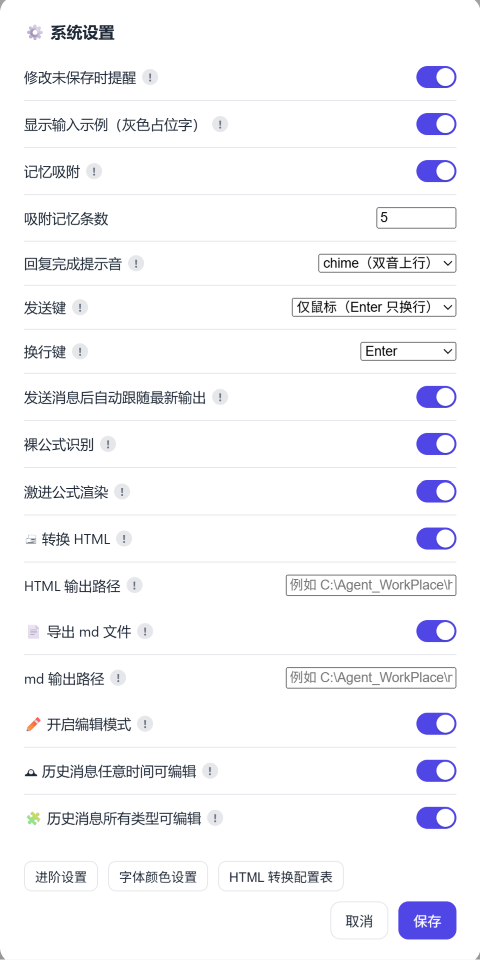
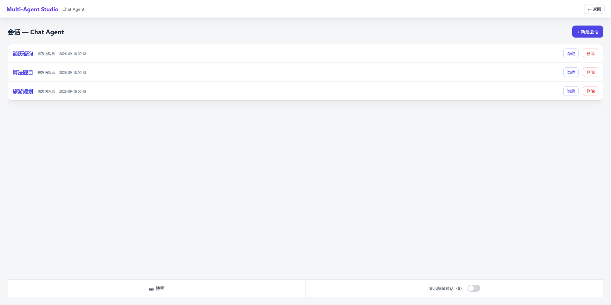
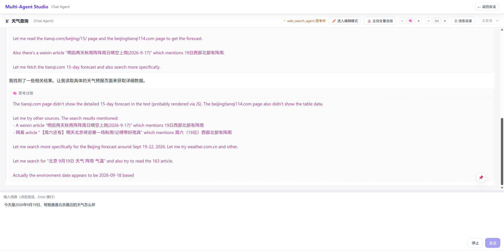
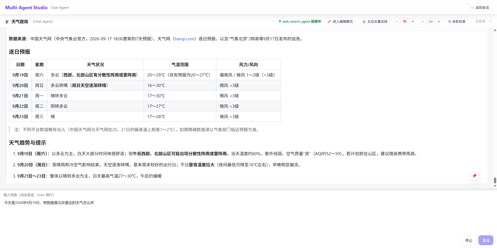
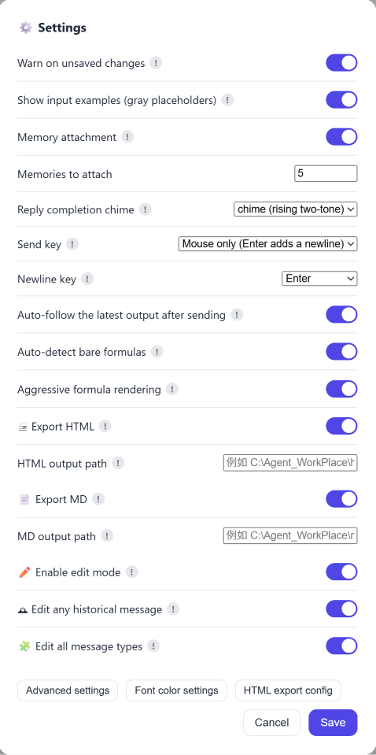
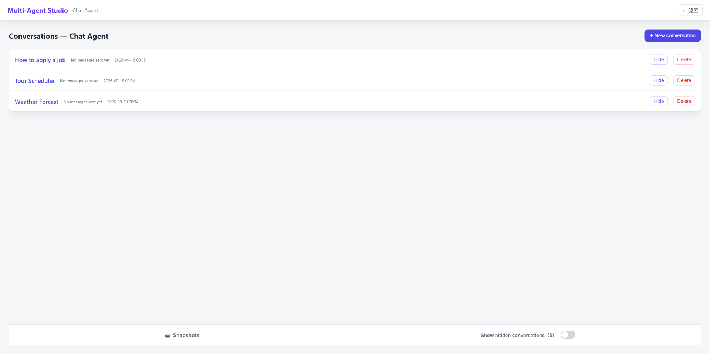
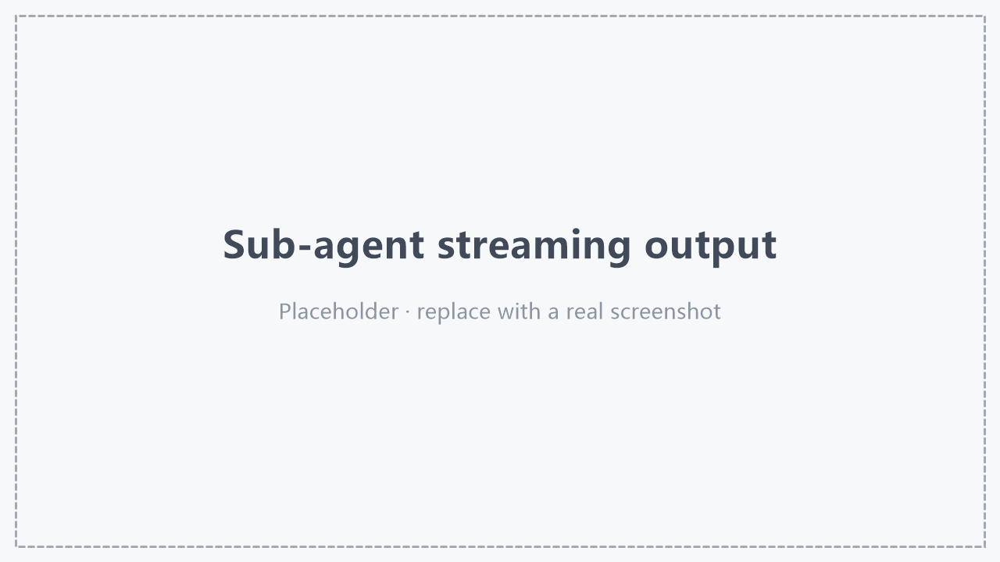

[中文](#multi-agent-studio) | [English](#multi-agent-studio-english)

# Multi-Agent Studio

> 基于 [LangGraph General-Use Multi-Agent Framework](https://github.com/ColtM1873/LangGraph-General-Use-Multi-Agent-Framework) 构建的**本地多智能体工作台**：Supervisor–Worker 编排 + 现代 Web GUI，Windows 单机运行。

## 目录

- [特性](#特性)
- [界面预览](#界面预览)
- [架构](#架构)
- [快速开始](#快速开始)
- [版本迁移（升级到新版本）](#版本迁移升级到新版本)
- [本地 MCP](#本地-mcp)
- [许可证](#许可证)

## 特性

### 多智能体编排

- **可视化配置** —— 在浏览器里创建 / 编辑 / 删除 multi-agent 配置；每份配置是一个 JSON 文件，并与一个 PostgreSQL checkpoint 库绑定。常用配置可保存为默认模板。
- **Supervisor–Worker 架构** —— 主 agent 负责理解、拆解与汇总，把任务委派给子 agent；每个子 agent 都是带 checkpointer 的子图，在线程内跨调用保持记忆。
- **子 agent 即工具** —— 每个子 agent 以「工具」的形式暴露给主 agent（名字 + 描述）；一次可并行调度多个子 agent，并回收它们的报告。
- **MCP 工具接入** —— 子 agent 可挂载 http / stdio 两种 MCP 工具源，配置页提供连通性检测。

### 模型与提供商

- **官方 provider** —— 内置 openai / anthropic / deepseek / google_genai，直接以 `provider:model` 选择。
- **任意 OpenAI 兼容模型** —— 填写模型名 + base_url 即可接入第三方端点。
- **精细采样参数** —— temperature / top_k / top_p / max_tokens / repetition_penalty 逐项可选。
- **DeepSeek 思考模式修复** —— 一键开启 reasoning_content 回填，规避思考模式 + 工具调用下的间歇性 400。

### 长期记忆

- **语义记忆** —— BGE-M3 embedding + PostgreSQL（pgvector）向量检索。
- **自动记忆吸附** —— 每条用户消息发送前自动检索相关记忆并附加上下文（条数可配）。
- **记忆读写工具** —— 主 agent 可主动写入 / 检索长期记忆。
- **模型下载进度** —— 首次使用自动下载 embedding 模型，界面与托盘实时显示进度。

### 对话与流式体验

- **逐 token 流式输出** —— 基于 WebSocket 实时渲染主 / 子 agent 输出。
- **思考过程** —— 推理内容独立成块，与正文按真实顺序交错显示。
- **工具调用可视化** —— 工具调用与结果内联展示并自动去重。
- **并行子 agent 分区** —— 多个子 agent 并行时按轮次分区，可下拉切换查看各自输出。
- **细粒度状态栏** —— 实时显示「谁 · 在做什么」（思考中 / 回答中 / 调取工具 / 等待工具 / 加载模型）。
- **Markdown + 公式** —— markdown-it 渲染、代码高亮、KaTeX 公式，另可选「裸公式识别 / 激进公式渲染」。
- **阅读友好** —— 正文与思考独立缩放、发送后自动跟随最新输出、可拖动的固定到底部按钮、回复完成提示音、发送 / 换行键可自定义。
- **图中途确认** —— 需要用户拍板时弹出应用内确认框（子 agent 使用区分样式）。

### 历史、会话与快照

- **会话持久化** —— 列出 / 继续 / 删除会话；只建了名字、尚未发言的空会话也会保留。
- **历史 Markdown 浏览** —— 主 / 子 agent 历史以 Markdown 只读呈现，并统计消息数与 token 用量。
- **消息目录** —— 下拉目录按用户消息展开，点击标题即可跳转。
- **历史消息编辑** —— 进入编辑模式后可按行修改历史消息（可选任意时间、任意类型），逐条提交并即时生效。
- **快照** —— 每次全量清空前自动保存主 / 子 agent 历史快照，可只读回看或删除。
- **隐藏会话** —— 按 agent 独立隐藏 / 显示会话。

### 总结与清空

- **阶段性总结** —— token 达到阈值时自动总结，不打断对话。
- **自动全量清空** —— 达到更高阈值时先快照、再总结、再清空（可保留最近若干轮）。
- **主动全量总结** —— 手动触发主 agent 或指定子 agent 的全量总结。

### 文件工具与导出

- **自研文件工具** —— read（分页 + 行号）/ edit（字符串级中段修改）/ write / search，以及目录、复制、移动、删除；所有操作限定在根目录内。
- **富格式读取** —— PDF / Word / PPT / Excel / EPUB / HTML 等自动转 Markdown；PDF 额外用 pdfminer 抽正文、pdfplumber 按框线抽表格；读取时在同目录生成可编辑的 `.md` 副本。
- **HTML 报告** —— 可选在回复后生成 HTML 报告并自动打开。
- **导出** —— 一键把单条回复导出为可打印 HTML（A4 优化）或 Markdown 文件。

### 设置与安装

- **全局设置** —— 记忆吸附、导出路径、历史折叠、编辑模式、公式识别等集中配置，支持中 / 英双语切换。
- **一键部署** —— `setup.bat` 自动创建虚拟环境、安装依赖并打包 `MultiAgentStudio.exe`；Windows 托盘常驻，浏览器自动打开。
- **pgvector 一键安装** —— 自动识别 PostgreSQL 与编译环境，优先从官方源码编译，失败回退预编译包。
- **连接串输入** —— PostgreSQL 连接支持「分步填写」或直接粘贴完整连接串。

## 界面预览

### 主界面 · 设置菜单



### 选择会话



### 子 agent 流式输出



## 架构

```
Supervisor（主 agent）                    Workers（子 agent）
  ├─ 文件工具                              ├─ MCP 工具（http / stdio）
  ├─ 记忆工具（写 / 读）                    └─ checkpointer=True 的子图
  ├─ 子 agent 工具（作为 tool 呈现）
  └─ 总结 / 清空历史
```

- 主 agent 是负责调度规划的 Supervisor；每个子 agent 是一个 `checkpointer=True` 编译的**子图**，作为节点挂载，在线程内跨调用保持记忆。
- 主图与各子图共享 `subagents_reports_submit` / `instructions_for_subagents`（故意同名）用于报告 / 指令穿透，而各自的消息通道键必须唯一。

## 快速开始

### 第一步：安装前置软件

1. **安装 Python 3.13**：到 https://www.python.org/downloads/ 下载并安装，安装时**请勾选「Add python.exe to PATH」**。
2. **安装 PostgreSQL**：程序用它保存会话历史和长期记忆。

### 第二步：下载

1. 打开本仓库页面，点右侧 **Releases**，在最新版本下点击 **Source code (zip)** 下载。

### 第三步：解压

1. 把 zip 解压到**任意位置**，得到一个 `multi-agent-studio-*` 文件夹。

### 第四步：进入项目文件夹

1. 双击点进去，一直点到能看到 `setup.bat`、`build_exe.bat` 的那一层。

### 第五步：一键安装 + 打包

1. 双击 `setup.bat`（或在文件夹空白处**右键** →「**在终端中打开**」→ 输入 `setup.bat` 回车）。
2. 首次会弹出「用户账户控制」，点「**是**」——这是为了启用 Windows 长路径支持，防止安装时报「路径过长」。
3. 脚本会自动：创建虚拟环境 → 安装全部依赖（首次约几分钟）→ 询问是否一键安装 pgvector → 打包出 `MultiAgentStudio.exe`。
4. 看到「安装完成！已生成 MultiAgentStudio.exe」，则exe运行文件打包成功。

> 安装脚本会自动启用 Windows 长路径，因此项目解压到任意目录都能正常安装，不必特意放到 C 盘根目录。

5. **安装 pgvector 扩展**（PostgreSQL 不自带，必须单独安装）：安装 PostgreSQL 后，双击项目里的 `install_pgvector.bat` 即可**一键安装**（或者在3.中选择一键安装pgvector）——它会自动识别 PostgreSQL 目录、自动寻找 Visual Studio 编译环境并**从官方源码编译**；若没有编译环境，会提示是否使用社区预编译包（会有风险提示）。装好后**无需打开 psql、也无需手动执行 `CREATE EXTENSION`**，程序会在首次聊天时自动创建。

> 没有安装 Visual Studio 也不影响：`install_pgvector.bat` 会自动回退到预编译包，并明确提示相关风险。
### 第六步：启动

1. 双击项目文件夹里的 `MultiAgentStudio.exe`。
2. 浏览器会自动打开界面，同时右下角出现托盘图标（右键图标可「打开 / 查看状态 / 退出」）。

> 从源码运行（开发用）：`python run.py --console`（前台，自动开浏览器 + 控制台日志）。

### 第七步：开始使用

1. 点「＋ 新建 multi-agent」填表单（API key、system prompt、子 agent、MCP、PostgreSQL 库）。
2. 先在 pgAdmin 建好 checkpoint 库（表单会提醒并做连通预检）。
3. 打开某个 agent → 选 / 建线程 → 开始流式对话。

> 每个 multi-agent 的身份绑定 `checkpoint_database`。创建后子 agent 不可增删 / 改名，但其 prompt / description / MCP 工具 / 模型仍可改。

## 版本迁移（升级到新版本）

升级时只需**保留少数「你的数据」，其余代码文件全部覆盖为新版本**即可。PostgreSQL 里的会话历史与长期记忆（checkpoint 库 / store 库）存在数据库里、不在此文件夹中，覆盖文件不会影响它们。

> ⚠️ **重要**：升级后**务必重新运行 `setup.bat`** 生成新的 `MultiAgentStudio.exe`。不要直接沿用旧版的 `MultiAgentStudio.exe`——部分版本更迭中，旧 exe 因打包的前端/后端代码与新版不匹配，会出现错误行为。

### 必须保留（覆盖前先备份，或复制到新版本目录）

| 文件 / 目录 | 说明 |
|---|---|
| `configs/` | 所有 multi-agent 配置（`<agent_id>.json`、`default.json`）与全局设置（`settings.json`）。含 API key、system prompt、数据库连接、阈值等。 |
| `snapshots/` | 全量总结前自动保存的会话快照（若生成过）。 |
| `.env` | 本地 MCP 服务器读取的 token 等环境变量。 |

### 可以直接覆盖（用新版本替换）

`app/`、`run.py`、`tray.py`、`launcher.py`、`scripts/`、`folder_of_MCPs/`、`md2print/`（源码）、`requirements.txt`、`setup.bat`、`setup.ps1`、`build_exe.py`、`build_exe.bat`、`icon.ico`、`.env.example`、`README.md`、`LICENSE` 等。

### 会自动重新生成（无需手动保留）

`venv/`（`setup.bat` 重建）、`MultiAgentStudio.exe` / `dist/` / `build/`（打包生成）、`logs/`（服务日志）、`__pycache__/` 等缓存。

### 推荐迁移步骤

1. 备份 `configs/`、`snapshots/`、`.env`。
2. 用新版本覆盖其余文件（或把上述三个复制进新解压的文件夹）。
3. **务必**运行 `setup.bat` 重新安装依赖并打包，生成新的 `MultiAgentStudio.exe`（不要沿用旧 exe）。
4. 双击新生成的 `MultiAgentStudio.exe`，确认历史会话、记忆与快照都还在。

## 本地 MCP

`folder_of_MCPs/` 是独立的 FastMCP 服务器（彩云天气、高德地图）。单独启动后，在子 agent 的 `mcp_servers` 里以 `http` 或 `stdio` 方式引用；token 从环境变量读取，见 `.env.example`。


## 许可证

[GPL-3.0](LICENSE)

---

[中文](#multi-agent-studio) | [English](#multi-agent-studio-english)

# Multi-Agent Studio (English)

> A **local multi-agent workbench** built on the [LangGraph General-Use Multi-Agent Framework](https://github.com/ColtM1873/LangGraph-General-Use-Multi-Agent-Framework): Supervisor–Worker orchestration with a modern web GUI, running locally on Windows.

## Table of Contents

- [Features](#features)
- [Screenshots](#screenshots)
- [Architecture](#architecture)
- [Quick Start](#quick-start)
- [Version migration (upgrading)](#version-migration-upgrading)
- [Local MCP servers](#local-mcp-servers)
- [License](#license)

## Features

### Multi-agent orchestration

- **Visual configuration** — create / edit / delete multi-agent configs in the browser; each config is a JSON file bound to a PostgreSQL checkpoint database. Save any config as the default template.
- **Supervisor–Worker architecture** — the main agent plans, delegates, and summarizes; each sub-agent is a subgraph compiled with `checkpointer=True`, keeping memory across calls within a thread.
- **Sub-agents as tools** — each sub-agent is exposed to the main agent as a tool (name + description); several sub-agents can be dispatched in parallel in one turn and their reports collected.
- **MCP tools** — attach `http` / `stdio` MCP servers per sub-agent, with a connectivity check in the config page.

### Models & providers

- **Built-in providers** — openai / anthropic / deepseek / google_genai via a `provider:model` prefix.
- **Any OpenAI-compatible model** — enter a model name + base_url to use third-party endpoints.
- **Fine-grained sampling** — opt in per parameter: temperature / top_k / top_p / max_tokens / repetition_penalty.
- **DeepSeek thinking-mode fix** — one toggle to back-fill `reasoning_content`, avoiding intermittent 400s in thinking mode with tool calls.

### Long-term memory

- **Semantic memory** — BGE-M3 embeddings + PostgreSQL (pgvector) retrieval.
- **Automatic memory attachment** — before each user message, relevant memories are retrieved and attached as context (count configurable).
- **Memory tools** — the main agent can write / search long-term memory on its own.
- **Model download progress** — the embedding model is downloaded on first use, with live progress in the UI and tray.

### Chat & streaming UX

- **Token-by-token streaming** — main / sub-agent output rendered live over WebSocket.
- **Reasoning display** — thinking is shown in its own collapsible block, interleaved with the body in true order.
- **Tool-call visualization** — tool calls and results are shown inline and de-duplicated.
- **Parallel sub-agent partitions** — when several sub-agents run in parallel, output is split per round with a dropdown to switch between them.
- **Granular status bar** — shows who is doing what in real time (thinking / answering / fetching tools / waiting for tools / loading model).
- **Markdown + math** — markdown-it rendering, syntax highlighting, KaTeX math, plus optional bare-formula / aggressive formula detection.
- **Reading comfort** — independent body / reasoning zoom, auto-follow on send, a draggable pin-to-bottom button, a reply-completed chime, and customizable send / newline keys.
- **In-graph confirmation** — when the graph needs your decision, an in-app confirm dialog appears (sub-agent dialogs use a distinct style).

### History, threads & snapshots

- **Persistent threads** — list / resume / delete conversations; named-but-unused threads survive reloads too.
- **Markdown history** — main / sub-agent history is shown read-only as Markdown, with message counts and token usage.
- **Message directory** — a drawer lists user messages and expands each reply's headings for jump-to navigation.
- **History editing** — enter edit mode to edit historical messages line by line (optionally any time / any type), submitted sequentially and applied instantly.
- **Snapshots** — before every full flush, main / sub-agent history is snapshotted automatically; browse read-only or delete.
- **Hide threads** — hide / show conversations independently per agent.

### Summary & history flush

- **Staged summarization** — automatic summaries once a token threshold is reached, without interrupting the conversation.
- **Automatic full flush** — at a higher threshold: snapshot, summarize, then clear (keeping a configurable number of recent turns).
- **Proactive full summary** — manually trigger a full summary for the main agent or a chosen sub-agent.

### File tools & export

- **Custom file tools** — read (pagination + line numbers) / edit (precise mid-string edits) / write / search, plus directory, copy, move, delete; everything is sandboxed to the root directory.
- **Rich-format reading** — PDF / Word / PPT / Excel / EPUB / HTML are converted to Markdown; PDFs additionally use pdfminer for text and pdfplumber for ruled-line tables, and a same-named editable `.md` copy is created on read.
- **HTML report** — optionally generate an HTML report after a reply and open it automatically.
- **Export** — one-click export of a single reply to a printable HTML (A4-optimized) or Markdown file.

### Settings & installation

- **Global settings** — memory attachment, export paths, history folding, edit mode, formula detection, and more, with a zh / EN language switch.
- **One-click deploy** — `setup.bat` creates the venv, installs dependencies, and packages `MultiAgentStudio.exe`; the app lives in the Windows tray and opens the browser automatically.
- **One-click pgvector install** — auto-detects PostgreSQL and a C++ toolchain, builds from official source first and falls back to a prebuilt package.
- **Connection-string input** — fill PostgreSQL in steps or paste a full connection string.

## Screenshots

### Main UI · Settings menu



### Thread selection



### Sub-agent streaming output



## Architecture

```
Supervisor (main agent)                 Workers (sub-agents)
  ├─ file tools                          ├─ MCP tools (http / stdio)
  ├─ memory tools (write/read)           └─ subgraph with checkpointer=True
  ├─ sub-agent tools (as tools)
  └─ summarization / history flush
```

- The main agent is a Supervisor that plans and delegates; each sub-agent is a **subgraph** compiled with `checkpointer=True` and mounted as a node, keeping memory across calls within a thread.
- The main graph and each subgraph share `subagents_reports_submit` / `instructions_for_subagents` channels (intentionally same-named) for passing reports / instructions, while their message channels must be unique.

## Quick Start

### 1. Prerequisites

1. Install **Python 3.13** from https://www.python.org/downloads/ — please check **"Add python.exe to PATH"**.
2. Install **PostgreSQL** (for checkpoints and long-term memory).

### 2. Download

1. Open the **Releases** page and download the latest **Source code (zip)**.

### 3. Extract

1. Extract the zip anywhere — you'll get a `multi-agent-studio-*` folder.

### 4. Enter the project folder

1. Drill down until you see `setup.bat` and `build_exe.bat`.

### 5. One-click install + build

1. Double-click `setup.bat` (or right-click an empty area → **Open in Terminal** → run `setup.bat`).
2. On the first UAC prompt, click **Yes** — this enables Windows long-path support so torch installs without the "path too long" error.
3. The script creates the venv, installs all dependencies (a few minutes the first time), offers to install pgvector, and builds `MultiAgentStudio.exe`.
4. Wait for "安装完成！已生成 MultiAgentStudio.exe".

> The installer enables Windows long paths automatically, so the project can be extracted anywhere.

5. Install the **pgvector** extension (PostgreSQL does not bundle it). After installing PostgreSQL, double-click `install_pgvector.bat` in the project (or confirm installing pgvector in 3.) — it auto-detects your PostgreSQL directory, finds the Visual Studio C++ toolchain, and **builds pgvector from the official source**. If no compiler is found, it offers to use a community prebuilt package (with an explicit risk warning). **No need to open psql or run `CREATE EXTENSION` manually** — the app creates it automatically on first chat.

> Visual Studio is optional: `install_pgvector.bat` falls back to a prebuilt package and clearly warns about the associated risk.
### 6. Launch

1. Double-click `MultiAgentStudio.exe`.
2. The browser opens automatically, and a tray icon appears (right-click for Open / Status / Quit).

> Running from source (development): `python run.py --console` (foreground — auto-opens browser + console logs).

### 7. Use

1. Click **＋ New multi-agent** and fill in the form (API key, system prompts, sub-agents, MCP servers, PostgreSQL databases).
2. Create the checkpoint database in pgAdmin first (the form reminds you and pre-checks connectivity).
3. Open an agent → pick/create a thread → chat with streaming Markdown.

> Each multi-agent's identity is bound to `checkpoint_database`. After creation, sub-agents cannot be added / removed / renamed, but their prompts / description / MCP tools / models can still be edited.

## Version migration (upgrading)

When upgrading, **keep only a handful of "your data" items and overwrite everything else with the new version**. Conversation history and long-term memory (checkpoint / store databases) live in PostgreSQL, not in this folder, so overwriting files does not affect them.

> ⚠️ **Important**: after upgrading, you **must re-run `setup.bat`** to generate a new `MultiAgentStudio.exe`. Do not keep using the old `MultiAgentStudio.exe` — on some upgrades the old exe misbehaves because its bundled frontend/backend code is out of sync with the new version.

### Must keep (back up first, or copy into the new version folder)

| File / directory | Notes |
|---|---|
| `configs/` | All multi-agent configs (`<agent_id>.json`, `default.json`) and global settings (`settings.json`). Contains API keys, system prompts, DB connections, thresholds, etc. |
| `snapshots/` | Conversation snapshots saved automatically before a full summary (if any were generated). |
| `.env` | Environment variables (e.g. tokens) read by the local MCP servers. |

### Safe to overwrite (replace with the new version)

`app/`, `run.py`, `tray.py`, `launcher.py`, `scripts/`, `folder_of_MCPs/`, `md2print/` (source), `requirements.txt`, `setup.bat`, `setup.ps1`, `build_exe.py`, `build_exe.bat`, `icon.ico`, `.env.example`, `README.md`, `LICENSE`, etc.

### Regenerated automatically (no need to keep)

`venv/` (rebuilt by `setup.bat`), `MultiAgentStudio.exe` / `dist/` / `build/` (built during packaging), `logs/` (server logs), `__pycache__/` and other caches.

### Recommended migration steps

1. Back up `configs/`, `snapshots/`, and `.env`.
2. Overwrite the remaining files with the new version (or copy the three items above into the freshly extracted folder).
3. **Must** run `setup.bat` to reinstall dependencies and rebuild a new `MultiAgentStudio.exe` (do not reuse the old exe).
4. Double-click the newly built `MultiAgentStudio.exe` and confirm history, memory, and snapshots are all intact.

## Local MCP servers

`folder_of_MCPs/` contains standalone FastMCP servers (Caiyun weather, AMap). Run them separately and reference them in a sub-agent's `mcp_servers` via `http` or `stdio` transport. Their tokens are read from environment variables — see `.env.example`.

## License

[GPL-3.0](LICENSE)
